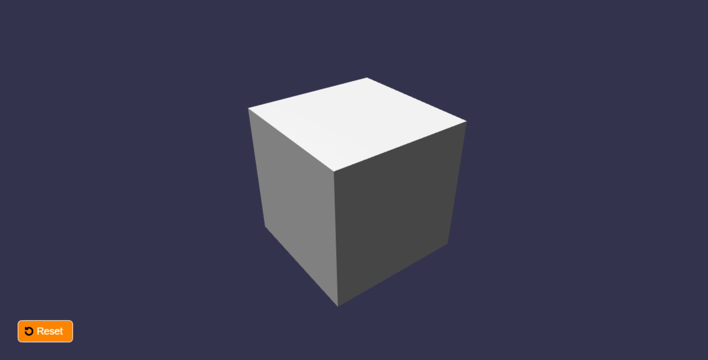

# 3D Box Resizer with Babylon.js

A simple 3D box resizer application built using Babylon.js, a powerful 3D framework for web development. This project allows users to interact with a 3D box, select its faces, and resize them based on cursor movement.



## Getting Started

Follow these instructions to get the project up and running on your local machine.

### Prerequisites

- [Node.js](https://nodejs.org) (version 12 or above) must be installed on your machine.

### Installation

1. Clone the repository to your local machine:

```bash
git clone https://github.com/your-username/3d-box-resizer.git
cd 3d-box-resizer
